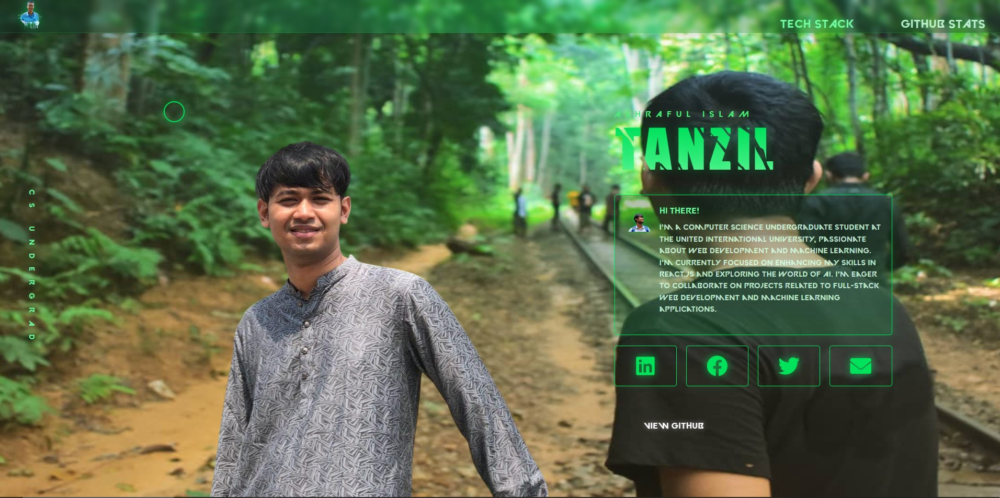

# Cyberpunk Portfolio | Ashraful Islam Tanzil

<p align="center">
  
</p>

A futuristic, cyberpunk-themed personal portfolio website with animated circuit patterns and a sleek green UI.

## ⚡️ Features

- **Cyberpunk Design**: Sleek, modern UI with animated circuit patterns and futuristic elements
- **Interactive UI**: Custom cursor, hover effects, and smooth animations
- **Responsive Layout**: Fully responsive design that works on all devices
- **Tech Stack Showcase**: Modal display of programming languages, frameworks, and tools
- **GitHub Stats Integration**: Live GitHub statistics display
- **Social Media Links**: Easy access to contact information and professional profiles

## 🚀 Technologies Used

- HTML5
- CSS3 with custom animations
- JavaScript (ES6+)
- jQuery for DOM manipulation
- GSAP for advanced animations
- Parallax.js for depth effects

## 🔧 Installation

1. Clone the repository:
   ```bash
   git clone https://github.com/ai-tanzil811/portfolio.git
   cd portfolio
   ```

2. Open `index.html` in your browser, or use a local development server:
   ```bash
   # Using Python's built-in server
   python -m http.server

   # OR using Node.js with http-server
   npx http-server
   ```

## 🎨 Customization

### Changing Colors

The website uses CSS variables for easy color customization. Edit the `:root` section in `style.css`:

```css
:root { 
  --cyber-green: #00E15C;
  --cyber-green-dark: #02863a;
  --cyber-green-light: #72F9A1;
  /* ...other color variables... */
}
```

### Updating Content

1. **Personal Information**: Edit the text in the `controller-box-content` section of `index.html`
2. **Tech Stack**: Modify the tech chips in the `tech-grid` section
3. **Profile Image**: Replace `2ndopinionprofilepic.png` with your own image
4. **GitHub Stats**: Update the GitHub username in the stats API URLs

### Adding New Sections

The modular structure makes it easy to add new sections. Follow the existing patterns for:
- Modal dialogs
- Content panels
- Animation elements

## 📱 Responsive Behavior

The portfolio is designed to work on all screen sizes:
- Desktop: Full experience with all animations
- Tablet: Optimized layout with slightly reduced effects
- Mobile: Streamlined interface with essential content

## 🔌 External Dependencies

- [Font Awesome](https://fontawesome.com/) - For icons
- [GSAP](https://greensock.com/gsap/) - For animations
- [Parallax.js](https://matthew.wagerfield.com/parallax/) - For depth effects
- [jQuery](https://jquery.com/) - For DOM manipulation


## 🙏 Credits

- COPIED design concept from Internet
- Animation techniques adapted from various open-source projects
- Icon library from Font Awesome

---

<p align="center">
  Made with ❤️ by <a href="https://github.com/ai-tanzil811">ai-tanzil811</a>
</p>
